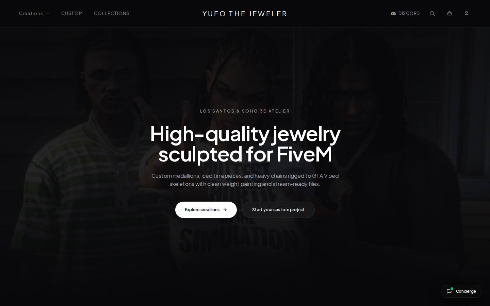
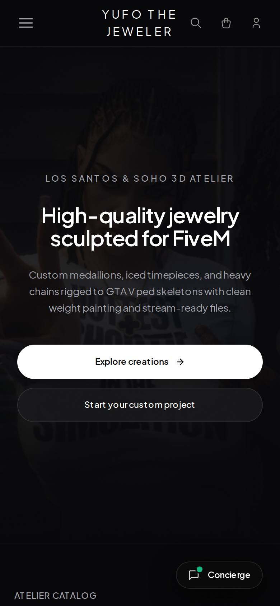

# YUFO The Jeweler — 3D Jewelry Atelier for FiveM

Storefront and ordering platform for **YUFO**, a studio that sculpts custom jewelry for FiveM roleplay servers: medallions, iced watches and chains, rigged to GTA V ped skeletons and delivered as stream-ready files.



## Features

- **Catalog and collections** with product pages and a cart
- **Bespoke configurator**: a step-by-step brief for one-of-one custom pieces
- **Discord login** and customer account
- **Checkout through Discord**: each order opens a private checkout channel on the YUFO server, handled by a bot
- **Admin area**: products, custom requests and customer reviews
- **Reviews** and a live concierge chat

<p>
  
</p>

## Stack

- Next.js 15 (App Router), React 19, TypeScript, Tailwind CSS
- Lenis smooth scrolling, Tabler and Lucide icons
- discord.js bot for checkout channels and order tracking

## Project structure

```
src/app/         pages (home, bespoke, collections, account, admin) and API routes
src/components/  runway hero, bespoke wizard, catalog, cart, modals
src/lib/         catalog, cart state, data access
scripts/         Discord bot (checkout channels, order notifications)
```

## Running locally

```bash
npm install
cp .env.example .env   # then fill in the values
npm run dev
```

Hero videos are not included in this repository to keep it light.
